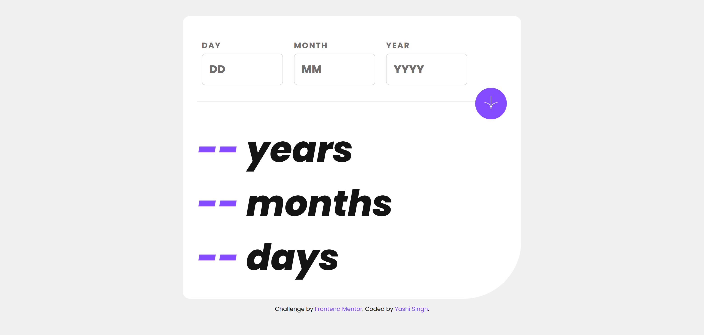
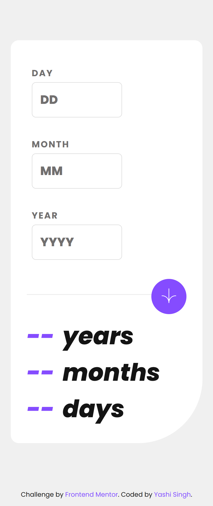

# Frontend Mentor - Age Calculator App Solution

This is a solution to the [Age calculator app challenge on Frontend Mentor](https://www.frontendmentor.io/challenges/age-calculator-app-dF9DFFpj-Q). Frontend Mentor challenges help you improve your coding skills by building realistic projects.

## Table of Contents

- [Overview](#overview)
  - [The Challenge](#the-challenge)
  - [Screenshot](#screenshot)
  - [Links](#links)
- [My Process](#my-process)
  - [Built With](#built-with)
  - [What I Learned](#what-i-learned)
  - [Continued Development](#continued-development)
  - [Useful Resources](#useful-resources)
- [Setup Instructions](#setup-instructions)
  - [Installing LESS](#installing-less)
  - [Running LESS](#running-less)
- [Author](#author)
- [Acknowledgments](#acknowledgments)

---

## Overview

### The Challenge

Users should be able to:

- View an age in years, months, and days after submitting a valid date through the form.
- Receive validation errors if:
  - Any field is empty when the form is submitted.
  - The day number is not between 1-31.
  - The month number is not between 1-12.
  - The year is in the future.
  - The date is invalid (e.g., 31/04/1991).
- View the optimal layout for the interface depending on their device's screen size.
- See hover and focus states for all interactive elements on the page.
- **Bonus**: See the age numbers animate to their final number when the form is submitted.

### Screenshot

**Desktop Screenshot**



**Mobile Screenshot**



### Links

- Solution URL: [Solution](https://www.frontendmentor.io/solutions/age-calculator-app-3SJzJiknHM)
- Live Site URL: [Live Site](https://yashi-singh-9.github.io/Age-Calculator-App/)

---

## My Process

### Built With

- Semantic HTML5
- CSS custom properties
- Flexbox for layout
- Mobile-first workflow
- JavaScript for validation and logic
- LESS (CSS Preprocessor)

### What I Learned

This project helped me to practice:

1. **Form Validation**:
   - How to validate fields with JavaScript for specific criteria like empty fields, valid date ranges, and logical date validation.

2. **LESS Preprocessor**:
   - Improved organization and reusability of styles by leveraging variables and mixins.

3. **Dynamic Error Messaging**:
   - Providing dynamic feedback for invalid inputs and visually indicating errors on form fields.

#### Example of a JavaScript Function for Validation:

```javascript
function showError(input, errorElement, message) {
  input.classList.add("error");
  input.previousElementSibling.classList.add("error");
  errorElement.textContent = message;
}
```

### Continued Development

In the future, I want to:

1. Add **animations** for age number changes.
2. Enhance accessibility by providing better ARIA feedback.
3. Refactor styles to use modern CSS features like CSS variables more effectively, reducing reliance on preprocessors.

### Useful Resources

- [MDN Web Docs - Date Object](https://developer.mozilla.org/en-US/docs/Web/JavaScript/Reference/Global_Objects/Date) - Helped me understand date validation.
- [LESS Documentation](https://lesscss.org/) - A great resource for learning LESS and its features.

---

## Setup Instructions

### Installing LESS

1. **Install Node.js**: If you don't already have Node.js installed, download it from [Node.js](https://nodejs.org/) and follow the installation instructions.

2. **Install LESS**: Open your terminal and run:

   ```bash
   npm install -g less
   ```

   This will globally install LESS on your system.

### Running LESS

To compile your `.less` files into `.css`, follow these steps:

1. Navigate to your project directory in the terminal.
2. Run the following command to compile the LESS file into CSS:

   ```bash
   lessc style.less style.css
   ```

3. Link the generated `style.css` file in your HTML `<head>`.

For automatic compilation, you can use a watcher tool like **less-watch-compiler**:

```bash
npm install -g less-watch-compiler
less-watch-compiler less css
```

This will watch your LESS files for changes and automatically compile them to CSS.

---

## Author

- Frontend Mentor - [Yashi-Singh-9](https://www.frontendmentor.io/profile/Yashi-Singh-9)
- LinkedIn - [Yashi Singh](https://www.linkedin.com/in/yashi-singh-b4143a246)

---

## Acknowledgments

Thanks to **Frontend Mentor** for providing such a practical and engaging challenge. It was a great opportunity to polish my JavaScript and LESS skills.
